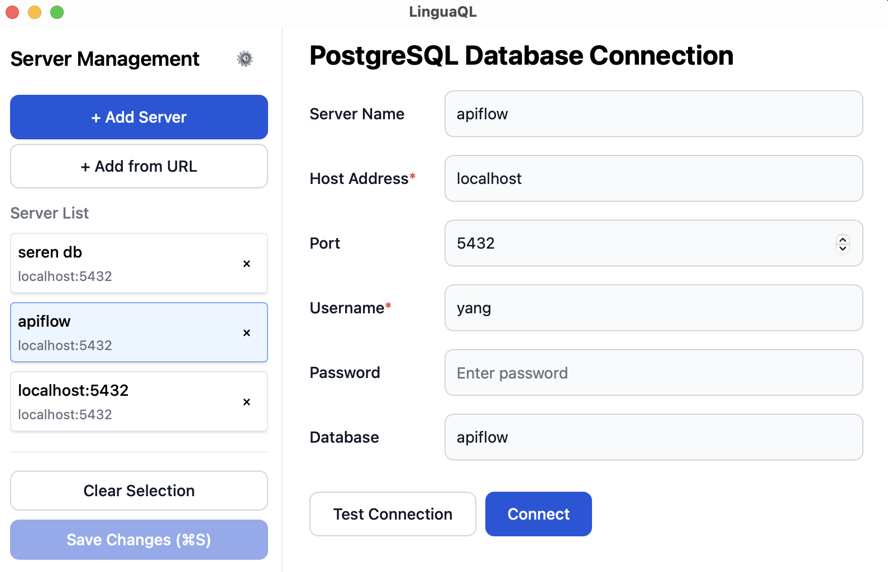
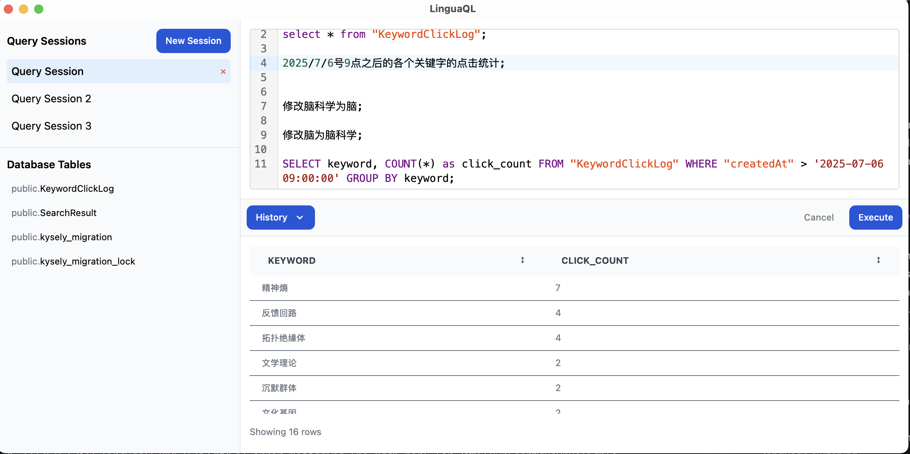

# LinguaQL

**Talk to Your Database in Plain English 🗣️ → SQL ⚡**

Transform natural language into powerful SQL queries with AI. Query your PostgreSQL databases using either traditional SQL or conversational English - LinguaQL speaks both languages fluently.

> **`LinguaQL ::= SQL | Natural Language`**

## ✨ Key Features

- 🤖 **Natural Language to SQL**: Convert plain English questions into optimized SQL queries
- 📂 **Server-Specific Sessions**: Isolated query sessions for each database connection
- 🛡️ **Configurable SQL Validation**: Control which SQL statement types are allowed
- 🔒 **Smart Security Checks**: Intelligent detection of potentially dangerous operations

## 📥 Download

Get the latest version of LinguaQL for your platform:

**[Download from GitHub Releases](https://github.com/zhy0216/linguaql/releases)**

Supported platforms: Windows, macOS, and Linux

## 🛠️ Development

For detailed development setup, architecture overview, and contribution guidelines, see our [Developer Guide](docs/dev.md).

## 📸 Screenshots

### Main Query Interface

## 🤝 Acknowledgments

LinguaQL draws inspiration from excellent database tools in the ecosystem. Special thanks to [Postico 2](https://eggerapps.at/postico2/) by Egger Apps for setting a high standard in PostgreSQL client design and user experience. Their attention to detail and user-centric approach has influenced many aspects of LinguaQL's interface and functionality.

## 📄 License

This project is licensed under the MIT License.

## 🐛 Issues & Support

If you encounter any issues or have suggestions for improvements, please feel free to:

- Open an issue on GitHub
- Submit a pull request
- Reach out to the development team
